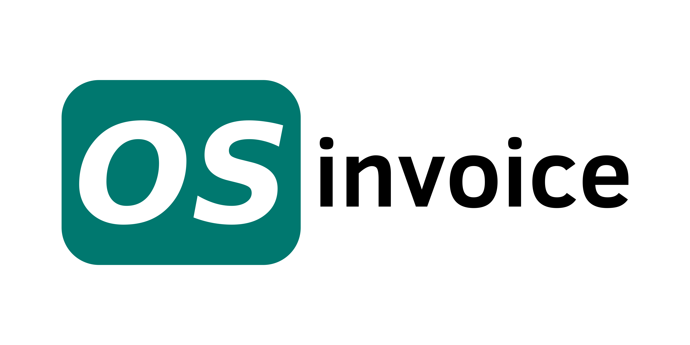

# OSInvoice
<p align="center">
  
</p>

An "Overly Simplistic" invoice manager. A portfolio project built to explore Next.js/React/SSR — coming from a Vue background.

Visit [OsInvoice here](https://osinvoice.vercel.app/)

## Tech Stack

- **Framework**: Next.js (App Router) / React / TypeScript
- **Backend**: Supabase (Auth + Postgres)
- **UI**: Tailwind CSS v4 / shadcn/ui
- **Testing**: Vitest / Playwright

## Features

- Manage companies, clients, and invoices
- PDF invoice generation
- Email invoice sharing
- Magic link authentication
- Soft-delete with trash/restore flow

## Getting Started

```bash
npm install
npx supabase start
npm run dev
```

Copy `.env.local` with your Supabase credentials:

```
NEXT_PUBLIC_SUPABASE_URL=...
NEXT_PUBLIC_SUPABASE_PUBLISHABLE_KEY=...
```

## Scripts

```bash
npm run dev        # Start dev server
npm run build      # Production build
npm run test       # Run unit tests
npm run e2e        # Run E2E tests
```
